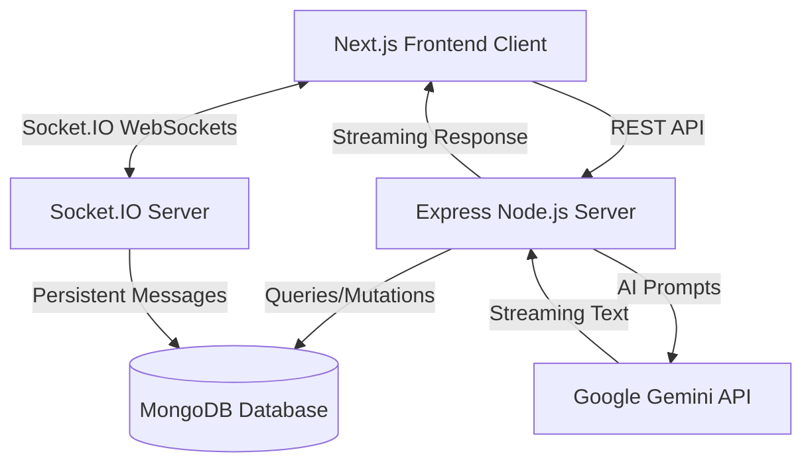

# TalkFlow

TalkFlow is a full-stack real-time communication platform built with Next.js, Node.js, Express, MongoDB and Socket.IO, featuring secure authentication, persistent one-to-one messaging, offline message delivery, and a Gemini-powered AI assistant with streaming responses.

## 1. Project Overview
TalkFlow provides a seamless, WhatsApp-style messaging experience. Users can register, search for other users, and engage in real-time private conversations. The platform also integrates an intelligent TalkFlow AI Assistant powered by Google Gemini, capable of streaming natural language responses directly into the chat interface.

## 2. Features
- **Real-Time Communication**: Instant message delivery powered by Socket.IO.
- **Persistent Messaging**: Offline message delivery and complete conversation history stored in MongoDB.
- **Authentication**: Secure JWT-based authentication with password hashing (bcrypt).
- **TalkFlow AI**: Built-in AI assistant leveraging the Gemini API with real-time text streaming and graceful retry handling.
- **Responsive UI**: A highly polished, mobile-responsive Next.js interface tailored for all screen sizes.
- **Modern Chat Aesthetics**: WhatsApp/Messenger-style message alignment (Sender Right, Receiver Left) with dynamic typing indicators.
- **Security First**: Protected API routes, explicit participant conversation checks, and robust CORS handling.

## 3. Tech Stack
- **Frontend**: Next.js (React), Tailwind CSS, Socket.IO Client.
- **Backend**: Node.js, Express, Socket.IO Server.
- **Database**: MongoDB, Mongoose.
- **AI Integration**: `@google/genai` (Gemini API).
- **Authentication**: JSON Web Tokens (JWT), bcrypt.
- **Language**: TypeScript across both client and server.

## 4. Architecture



## 5. Project Structure

```text
talkflow/
│
├── client/                 # Next.js Frontend
│   ├── app/                # Next.js App Router (pages/layouts)
│   ├── components/         # Reusable React components (auth, chat, sidebar)
│   ├── hooks/              # Custom React hooks (Socket, AI, Messages)
│   ├── lib/                # API and Socket configuration
│   └── types/              # TypeScript definitions
│
├── server/                 # Node.js/Express Backend
│   ├── config/             # Database connection setup
│   ├── controllers/        # Route controllers (auth, messages, ai)
│   ├── middleware/         # Auth and Error middlewares
│   ├── models/             # Mongoose schemas (User, Message, Conversation)
│   ├── routes/             # Express API routes
│   ├── services/           # AI service and retry logic
│   └── socket/             # Socket.IO handlers and connection management
│
└── README.md
```

## 6. Authentication Flow
- Users register/login via standard REST endpoints (`/api/auth`).
- Server validates credentials, hashes passwords, and issues a secure `httpOnly` JWT cookie.
- Socket.IO establishes a connection, extracting the `httpOnly` token in a custom middleware (`socketAuth.ts`) to authenticate real-time streams.

## 7. Real-Time Messaging Flow
- Client emits `message:send` to the Socket.IO server.
- Server validates that the sender is an authorized participant in the conversation.
- Message is immediately persisted to MongoDB.
- Server broadcasts `message:new` exclusively to the specific `user:${receiverId}` room.

## 8. AI Chat Flow
- Client sends an HTTP POST request to `/api/ai/chat/stream` with the conversation history.
- The server interacts with the Gemini API using exponential backoff (retrying temporary 503s).
- The server pipes the Gemini streaming response directly to the Client via `TextDecoder` streams, resulting in a real-time typewriter effect.

## 9. Environment Variables
Copy the `.env.example` file in the root directory to `.env.local` inside the `client` and `.env` inside the `server`. Provide your own values:

```env
# Backend
PORT=5000
MONGODB_URI=your_mongodb_connection_string
JWT_SECRET=your_jwt_secret
GEMINI_API_KEY=your_gemini_api_key
GEMINI_MODEL=gemini-3.6-flash

# Frontend
NEXT_PUBLIC_API_URL=http://localhost:5000/api
NEXT_PUBLIC_SOCKET_URL=http://localhost:5000
```

## 10. Installation
1. Clone the repository.
2. Install client dependencies:
   ```bash
   cd client && npm install
   ```
3. Install server dependencies:
   ```bash
   cd server && npm install
   ```

## 11. Running Locally
Start the backend server (runs on port 5000):
```bash
cd server
npm run dev
```

Start the frontend client (runs on port 3000):
```bash
cd client
npm run dev
```

## 12. API Overview

| Method | Endpoint | Purpose | Auth Required |
|--------|----------|---------|---------------|
| POST   | `/api/auth/register` | Register a new user | No |
| POST   | `/api/auth/login` | Authenticate and issue JWT | No |
| POST   | `/api/auth/logout` | Clear JWT cookie | Yes |
| GET    | `/api/users/search` | Search users by name/username | Yes |
| GET    | `/api/conversations` | Get all user's conversations | Yes |
| GET    | `/api/messages/:otherUserId` | Get chat history with a user | Yes |
| POST   | `/api/ai/chat/stream` | Stream AI response | Yes |

## 13. Socket.IO Events

- `connection`: Establishes an authenticated socket link.
- `disconnect`: Fires on cleanup or connection loss; updates online status.
- `message:send`: Client payload containing conversationId, receiverId, and text.
- `message:new`: Server payload broadcasting a newly saved message.
- `typing:start` / `typing:stop`: Broadcasts typing indicators to conversation participants.

## 14. Screenshots
*(Placeholder for actual application screenshots)*
- **Login/Registration View**
- **Chat Interface**
- **AI Assistant Interface**
- **Mobile Responsive Layout**

## 15. Future Improvements
- Group Chat functionality.
- Image/File uploads.
- Read receipts.
- Push notifications for offline mobile users.

## 16. Security Notes
- All backend routes are strictly protected by JWT validation.
- Cross-Origin Resource Sharing (CORS) is configured dynamically to permit appropriate frontend connections.
- Strict API participant matching blocks users from retrieving chats they do not belong to.
- Secrets (`GEMINI_API_KEY`, `MONGODB_URI`) are kept entirely on the server.

## 17. Author
Developed as a portfolio project showcasing modern full-stack real-time architectural patterns.
